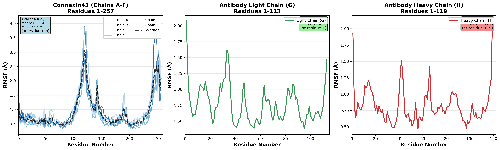

# Abini_7: Connexin 43 - M1 Antibody Membrane System

This repository contains the simulation parameters, analysis scripts, and key results for the molecular dynamics (MD) simulation of the Connexin 43 (Cx43) hexamer bound to the M1 antibody in a POPC lipid bilayer.

## Project Background
The project focuses on transitioning the simulation from the CHARMM force field to the **AMBER force field** to improve the correlation between binding energy calculations and experimental $K_D$ values.

## System Components
- **Protein**: Connexin 43 (6 subunits) + M1 Antibody (Light & Heavy chains)
- **Membrane**: POPC lipid bilayer
- **Force Field**: Amber19SB (Protein) / Lipid17 (Lipids)
- **Solvent**: TIP3P Water with 0.15M NaCl

## Simulation Workflow
1. **Step 6: Energy Minimization** - Steepest descent to resolve atomic clashes.
2. **Step 7: Equilibration** - 50ns run with position restraints on protein backbones to relax the membrane.
3. **Step 8: Production** - 1ns initial production run for stability verification.

## Analysis & Results
The system's stability was verified through:
- **Energy**: Smooth convergence of potential energy.
- **RMSD**: Backbone RMSD stabilized between 1.5 - 2.0 Å.
- **RMSF**: Superimposed analysis of Connexin chains (A-F) showed high structural symmetry.

### Visualizations
- **RMSF Plot**: Segmented analysis for hexamer symmetry and antibody flexibility.


## Repository Structure
- `scripts/`: Python scripts for RMSD/RMSF plotting.
- `mdp/`: GROMACS simulation parameter files.
- `top/`: Topology files (excluding heavy large files).

## Usage
To reproduce the plots:
```bash
python plot_rmsf_final.py
